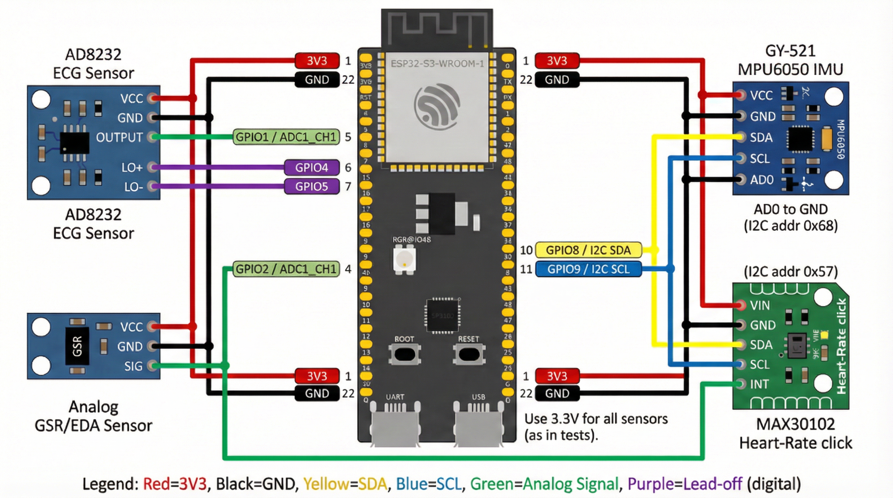
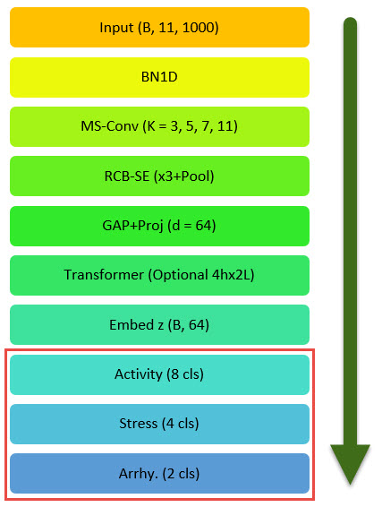
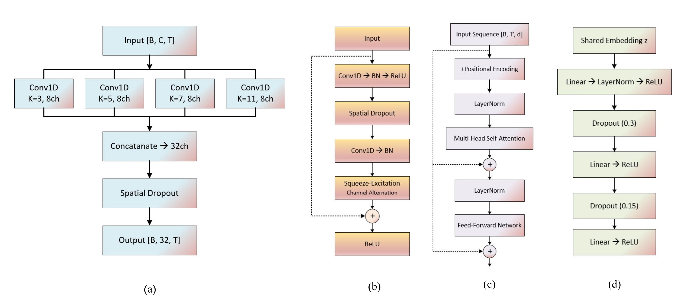

# Hardware-Aware Edge Deep Learning for Multimodal Biomedical Monitoring

** Best Paper Award**

**IEEE ICHI 2026** — Can a microcontroller detect stress, arrhythmia, and physical activity simultaneously from raw wrist sensors, with no cloud connection?

This paper says yes.

> **"Hardware-Aware Edge Deep Learning for Multimodal Biomedical Monitoring on Resource-Constrained SoCs"**
> *Sara Aly, Shahnam Mirzaei — California State University, Northridge*
> *IEEE International Conference on Healthcare Informatics (ICHI) 2026*
>
> 📄 **Paper:** _link coming upon publication_
> 📎 **DOI:** _coming upon publication_

---

## What it does

A single compact neural network runs **entirely on an ESP32-S3** and jointly predicts three health signals every 10 seconds from raw biosensor data:

| Output | Task | Classes |
|--------|------|---------|
| 🏃 Activity | What are you doing? | Sitting · Walking · Cycling · Driving · Working · Stairs · Table Soccer · Lunch |
| 😰 Stress | Are you stressed? | Baseline · Stress · Amusement · Meditation |
| 💓 Arrhythmia | Is your heart rhythm normal? | Normal · Abnormal |

A **motion-aware alert layer** derived from raw accelerometer statistics sits between the model and the user — for example, it suppresses a stress alert during intense exercise to prevent alert fatigue, and escalates an arrhythmia alert under high motion into a `critical_alert`.

---

## Hardware

Four sensors feed into a single ESP32-S3 board over ADC and I²C:



| Sensor | Signal | Interface | Unified Channel |
|--------|--------|-----------|----------------|
| AD8232 | ECG | ADC | ch 0 |
| MAX30102 | PPG (pulse oximetry) | I²C (0x57) | ch 1 |
| MPU6050 / GY-521 | Accelerometer X/Y/Z | I²C (0x68) | ch 2–4 |
| Grove GSR v1.2 | EDA / Galvanic Skin Response | ADC | ch 5 |

---

## Model Architecture



The pipeline takes a 10-second window (11 channels × 1000 samples @ 100 Hz) through four stages:



**(a) Multi-Scale Temporal Convolution** — four parallel Conv1D branches (k = 3, 5, 7, 11) capture features at different temporal resolutions and concatenate into a 32-channel representation.

**(b) Residual Block + Squeeze-Excitation (RCB-SE)** — skip connections plus channel-wise attention, so the model learns which sensor is most informative at each moment.

**(c) Transformer-Lite Encoder** — 2 layers, 4 heads, d_model = 64. Captures long-range temporal dependencies across the full 10-second window. Used during training; bypassed at deployment.

**(d) Improved Task Heads** — three parallel MLPs with progressive dropout (0.3 → 0.15) share the same backbone embedding and each produce one prediction.

**For embedded deployment the Transformer is bypassed**, reducing the model from 82,782 to **15,758 parameters (~61.6 KB FP32)** — a CNN-only path that fits comfortably in ESP32-S3 flash.

---

## Results

### 5-Fold Subject-Wise Cross-Validation

| Task | Accuracy | F1 Macro |
|------|----------|----------|
| Activity (8-class) | 52.3% ± 1.8% | 31.1% ± 2.0% |
| Stress (4-class) | 69.4% ± 4.2% | 49.9% ± 4.5% |
| Arrhythmia (2-class) | **75.0% ± 6.6%** | **74.7% ± 6.4%** |

Arrhythmia AUC-ROC: **0.843 ± 0.077** · Sensitivity: 70.3% · Specificity: 80.1%

### Held-Out Test Set (13 unseen subjects, 3,803 windows)

| Task | Samples | Accuracy | Precision | Recall | F1 |
|------|---------|----------|-----------|--------|----|
| Activity (8-class) | 2,672 | 55.9% | 34.3% | 36.1% | 34.8% |
| Stress (4-class) | 254 | 73.2% | 56.4% | 36.0% | 40.4% |
| Arrhythmia (2-class) | 877 | 72.3% | 62.0% | 59.1% | 59.7% |

### On-Device Performance (ESP32-S3)

| Metric | Value |
|--------|-------|
| Parameters (deployed CNN) | 15,758 (~61.6 KB FP32) |
| Inference time | 298 ms per 10 s window |
| Duty cycle | 3% |
| Power draw | 0.53 W (5.23 V @ 0.1 A) |
| Flash footprint | 370 KB sketch |
| Heap free | 315 KB |
| PSRAM free | 8.18 MB |

### Motion-Aware Alert Benchmark (4 Synthetic Scenarios, 100 samples each)

| Case | Scenario | Stress Acc. | Arr. Acc. | Alert Acc. | Alert Rate |
|------|----------|-------------|-----------|------------|------------|
| 1 | Stress + Sedentary | 85% | 99% | **85%** | 86% |
| 2 | Stress + Exercise | 82% | 88% | N/A (suppress) | 12% false alerts |
| 3 | Arrhythmia + Sedentary | 57% | 94% | **94%** | 96% |
| 4 | Arrhythmia + High Motion | 72% | 95% | **95%** | 95% |

Average alert accuracy across triggering cases: **91.3%**

> Full metrics and per-class breakdowns: [`evaluation_results/PAPER_RESULTS_SUMMARY.md`](evaluation_results/PAPER_RESULTS_SUMMARY.md)

---

## Datasets

Three public datasets unified into a common 100 Hz, 11-channel tensor (missing channels zero-filled):

| Dataset | Task | Subjects | Original Rate | Samples |
|---------|------|----------|---------------|---------|
| [PPG-DaLiA](https://archive.ics.uci.edu/dataset/495/ppg+dalia) | Activity (8-class) | 15 | 64 Hz | 12,806 |
| [WESAD](https://archive.ics.uci.edu/dataset/465/wesad+wearable+stress+and+affect+detection) | Stress (4-class) | 15 | 700 Hz | 3,439 |
| [MIT-BIH Arrhythmia](https://physionet.org/content/mitdb/1.0.0/) | Arrhythmia (binary) | 48 records | 360 Hz | 5,459 |

**Total: 21,704 balanced windows · subject-wise split: 46 train / 6 val / 13 test**

> The three datasets have zero label overlap — each window carries only the labels from its source. The 4-case alert benchmark therefore uses synthetic signal compositions to evaluate the combined sensing–inference–alerting pipeline.

---

## Repository Structure

```
├── src/                         # Core Python modules
│   ├── data_loader.py           # Loads PPG-DaLiA, WESAD, MIT-BIH
│   ├── dataset_integration.py   # Cross-dataset normalisation & windowing
│   ├── unify_data.py            # Resamples all signals to 100 Hz
│   └── models/
│       └── cnn_transformer_lite.py   # CNN + Transformer-Lite model
│
├── scripts/                     # Training & evaluation scripts
│   ├── train_improved.py        # Focal loss + augmentation
│   ├── cv_model_c.py            # 5-fold subject-wise cross-validation
│   ├── comprehensive_evaluation.py
│   ├── ablation_study.py
│   └── export_weights_esp32.py  # Generates model_weights.h for firmware
│
├── firmware/esp32/              # PlatformIO C++ firmware (ESP32-S3)
│   └── src/
│       ├── main.cpp
│       ├── inference/           # On-device CNN inference engine (C++)
│       ├── sensors/             # AD8232 · MAX30102 · MPU6050 · GSR drivers
│       ├── filters/             # ECG bandpass filter
│       └── buffering/           # Sliding-window buffer
│
├── edge_deployment/             # Normalisation stats + deployment config
├── evaluation_results/          # Paper metrics (JSON + Markdown)
├── training_results/
│   └── subject_splits.json      # Train / val / test subject IDs
├── figures/                     # Pipeline diagrams, hardware wiring, result plots
└── requirements.txt
```

---

## Quickstart

```bash
git clone https://github.com/sara-kaz/edge-biomedical-monitoring.git
cd edge-biomedical-monitoring
pip install -r requirements.txt   # Python 3.9, PyTorch ≥ 1.12
```

**Reproduce 5-fold cross-validation:**
```bash
python scripts/cv_model_c.py
```

**Train from scratch:**
```bash
python scripts/train_improved.py
```

**Export weights to C header for ESP32 firmware:**
```bash
python scripts/export_weights_esp32.py
# → writes firmware/esp32/src/inference/model_weights.h
```

**Flash to ESP32-S3:**
```bash
cd firmware/esp32 && pio run --target upload
```

---

## Citation

```bibtex
@inproceedings{aly2026edge,
  title     = {Hardware-Aware Edge Deep Learning for Multimodal Biomedical
               Monitoring on Resource-Constrained {SoCs}},
  author    = {Aly, Sara and Mirzaei, Shahnam},
  booktitle = {2026 IEEE International Conference on Healthcare Informatics (ICHI)},
  year      = {2026},
  note      = {DOI to be added upon publication}
}
```

---

## License

Released for academic use. See [LICENSE](LICENSE) for details.
